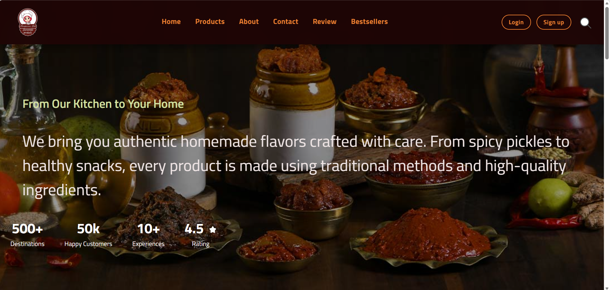
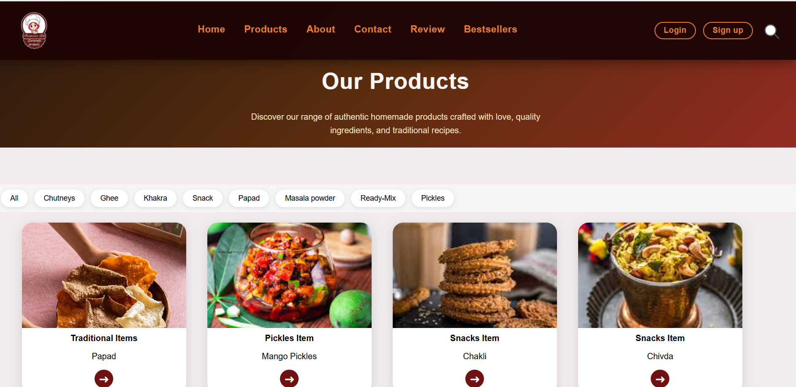

# icp15-group-project-2-html-css-annapurna-# 
🏠 Annapurna Hub

Live Website: https://your-website-link.com

---

> Homemade Food Website (HTML + CSS Project)

Annapurna Hub is a multi-page website for a homemade food business.  
Users can explore products, view categories, and contact for orders.

---

##  Features

- Home page with categories & seasonal products  
- Product pages (Pickles, Snacks, Masala, etc.)  
- Contact page with order form  
- Customer review section  
- Login & Signup pages  
- Fully responsive design  
- No JavaScript (Pure HTML & CSS)

---

## Tech Stack

- HTML5  
- CSS3  
- Flexbox & Grid  

---

## Project Structure

project/
│
├── index.html
├── pages/
├── css/
└── images/

---

## 📸 Screenshots

<h3>🏠 Home Page</h3>

<h3>📦 Product Page</h3>

<h3>📋 Contact Page</h3>

---

##  How to Run

1. Download or clone this repository  
2. Open `index.html` in browser  

---

## 👩‍💻 Contributors

<table>
  <tr>
    <td align="center">
       
      <b>Shravani Sherkar</b> 
      <a href="https://github.com/shravanisherkar31">@shravanisherkar31</a>
    </td>

    <td align="center">
       
      <b>Sushmita Bhelkar</b> 
      <a href="https://github.com/sushmitabhelkar24">@sushmitabhelkar24</a>
    </td>

    <td align="center">
       
      <b>Anjali Mhase</b> 
      <a href="https://github.com/anjalimhase24">@anjalimhase24</a>
    </td>

    <td align="center">
       
      <b>Rushali Lekurwale</b> 
      <a href="https://github.com/rushalilekurwale10">@rushalilekurwale10</a>
    </td>

    <td align="center">
       
      <b>Pratiksha Shinde</b> 
      <a href="https://github.com/PratikshaShinde21">@PratikshaShinde21</a>
    </td>
  </tr>
</table>

---

## Contact

  shravanisherkar@gmail.com  

---

⭐ If you like this project, give it a star!
